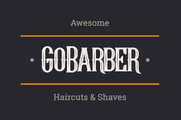

<div align="center">

#  

[Features](#Features) |
[Mobile](#Mobile) |
[Web](#Web) |
[Getting Started](#Getting_Started)


Builded in Node, React, React-Native, Typescript and Express, this application was designed to create, find and list appointments from a barber. Also, listing barbers and avaliability of schedules to clients.

</div>

## Features

You can make appointments if a available barber, looking the day, hour, month and year. Show your past and upcoming appointments.
Now, if you're a barber, will be possible to list your day, month and year schedule.
The account creation can be use in any application. The authentication, security and updates from your profile is garatied.

## Getting_Started

To execute this project, you will need:
- Insominia;
- Code Editor (I recommend the Visual Studio Code);
- Docker (With PostGres, MongoDb and Redis containers);

To begin the development, is necessary to clone this GITHUB repository:

```shell
cd "dir from your preference"
git clone https://github.com/Merchanntt/Go_Barber
```

### Building

To initialize this project, first, run this command on the 3 folders and install all the dependencies: 

```shell
yarn 
```

Now, you just need to use the next commands, to run the server and the api will be ready:

```shell
cd server
yarn dev:server

cd web
yarn start

cd mobile
yarn start
```

## Tests

Let's suppose that you make some changes and wants to see if the applications still works. To make sure, use...

```
yarn test
```

Feel free to change on your one way <3
